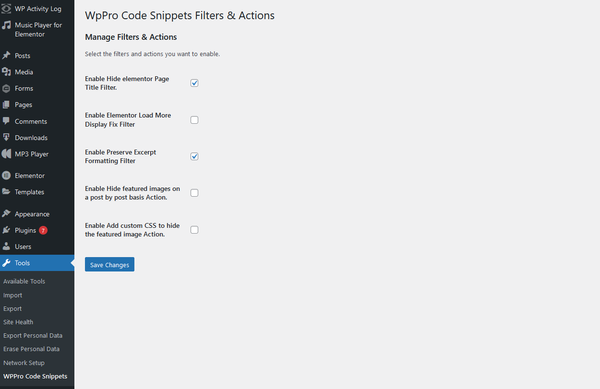
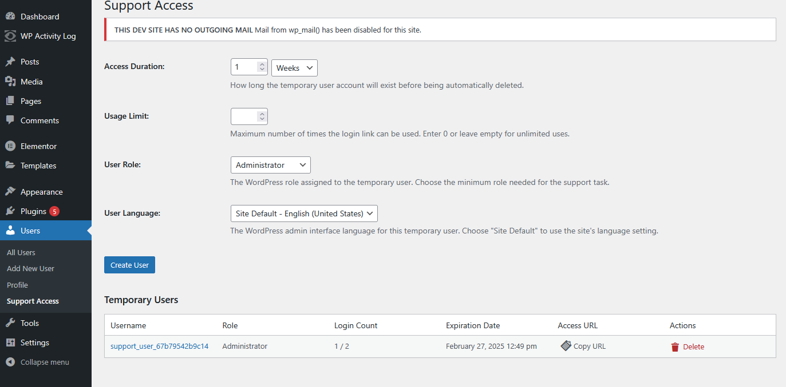

  ___  _     _                         
 / _ \| |   | |                        
/ /_\ \ |__ | | _____  _ __  ___ _   _ 
|  _  | '_ \| |/ / _ \| '_ \/ __| | | |
| | | | | | |   < (_) | | | \__ \ |_| |
\_| |_/_| |_|_|\_\___/|_| |_|___/\__,_|
                                       
     
		
		\||/
                |  @___oo
      /\  /\   / (__,,,,|
     ) /^\) ^\/ _)
     )   /^\/   _)
     )   _ /  / _)
 /\  )/\/ ||  | )_)
<  >      |(,,) )__)
 ||      /    \)___)\
 | \____(      )___) )___
  \______(_______;;; __;;;

# WPProAtoZ-Code-Snippets

This plugin allows you to choose from an assortment of code snippets that are useful when building out your website especially if you use Elementor. The snippets can be turned on or off from the tools menu Tools >> WPPro Code Snippets

### About the plugin
These are the features so far 
- Enable Hide elementor Page Title Filter. This one is to hide the Page/Post title though out the whole site/
- Enable Elementor Load More Display Fix Filter	
- Enable Preserve Excerpt Formatting Filter	
- Enable Hide featured images on a post by post basis Action.	
- Enable Add custom CSS to hide the featured image Action.
- This plugin also adds a new admin page where you can create one off temporary logins you can give to ad min support. 

For more information on the PLUGIN visit the official website: https://WPProAtoZ.com .

### Key Features

- Easily turn on and off the snippetts you need want.
- Save the hassel of placing snippets into the function file.
- Adds a support access page.

## Installation

1. Download the plugin ZIP file from the [releases page](https://github.com/Ahkonsu/wpproatoz-code-snippets/releases/).
2. Upload it to your WordPress site via the **Plugins** > **Add New** > **Upload Plugin**.
3. Activate the plugin through the **Plugins** menu in WordPress.

## Usage

1.  Navigate to tools menu Tools >> WPPro Code Snippets
2.  Look for the admin support page on the Users >> Support Access

### Admin Settings
1. Turn on and off the differnt filters or actions. 
2, Admin support access creates temp logins for the site that are limted use and expire. 

## Frequently Asked Questions

### question 1?

Can I support this quest?
	Yes you can by going to https://wpproatoz.com and supporting our business. 

### question 2?

Will there be more features?
yes we will ad them as we find them useful.

### question 3?
I have ha sugestion for "X" snippet.
we are always looign for additions please submit it here. 

## Screenshots

1. **Admin Settings Page** - Admin page for snippits.

2. ** Support Access Page** - the support access page

## Demo

This is an admin plugin so there is no demo of it you can get the plugin here at [WPProAtoZ.com](https://wpproatoz.com/plugins).

## Changelog

### Full change log here https://github.com/Ahkonsu/wpproatoz-code-snippets/compare/v0.5.0...v0.5.4

## Future Updates

The plugin will automatically fetch updates via the WordPress admin from this Github repository using the WordPress update mechanism (you will be notified in the admin when an update is available).

## License

This plugin is licensed under the GPL v2 or later. For more information, please see the [GNU General Public License](https://www.gnu.org/licenses/gpl-2.0.html).

## Contributing
Ahkonsu, Carl
Contributions are welcome! Feel free to fork the repository, submit issues, or create pull requests.

---

**Note:** 
